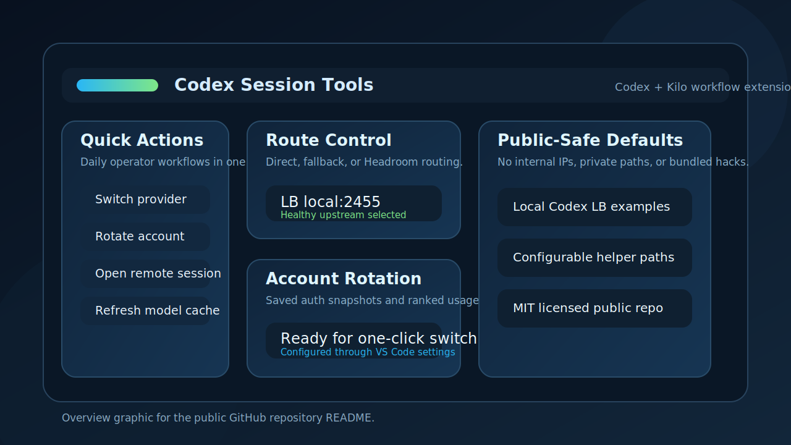

# Codex Session Tools

Public VS Code extension for Codex and Kilo workflows.

## Overview

Codex Session Tools adds operational workflow helpers to Codex and Kilo through standard VS Code contribution points. It does not patch upstream webviews or bundle modifications into the official extensions.

The project focuses on three practical workflow areas:

- provider switching through `~/.codex/config.toml`
- account rotation with saved auth snapshots
- Codex-LB route control, usage visibility, and helper actions

## Why This Exists

This repository is the canonical public home for the OLL4 extension work that used to be split across earlier private prototypes.

The goal is to keep one maintained extension identity for:

- Codex sidebar workflows
- Kilo sidebar and tab workflows
- configurable helper actions that can be adapted to local operator setups

## Supported Surfaces

- Codex sidebar views: `chatgpt.sidebarView`, `chatgpt.sidebarSecondaryView`
- Kilo sidebar view: `kilo-code.SidebarProvider`
- Kilo tab panel: `kilo-code.new.TabPanel`

## Main Features

- Quick Actions menu for daily operator workflows
- toolbar buttons for reload, screenshot capture, remote session launch, and Codex-LB route selection
- one-click account rotation from saved auth snapshots
- Codex-LB usage and route visibility in VS Code
- helper prompts such as `συνεχισε` and memory-oriented shortcuts

## What Is Original Here

- the VS Code extension glue code and command surface
- multi-surface toolbar integration for Codex and Kilo
- public-safe Codex-LB route metadata handling
- account rotation workflow based on configurable ranking data and local auth snapshots

## Configuration Notes

- All Codex-LB URLs now default to local example addresses (`127.0.0.1`) instead of internal infrastructure.
- Account ranking, remote-session presence sync, and helper command paths are configurable in VS Code settings.
- Helper commands can optionally read a local env file if your setup needs external credentials.

## Limitations

- The extension assumes you already have Codex and/or Kilo installed.
- Some helper actions are only useful if you configure your own local scripts, route-state files, or account ranking source.
- This repository does not publish secrets, runtime state, or internal infrastructure defaults.

## Release Status

- Current public repo version: `0.2.3`
- License: MIT
- Changelog: see [CHANGELOG.md](CHANGELOG.md)

## Packaging

Packaging and marketplace notes live in [PUBLISHING.md](PUBLISHING.md).
